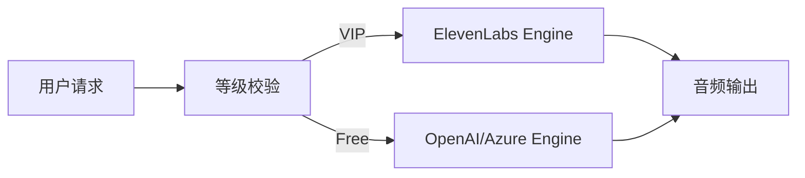

# AURA 商业化转型与成本优化实施报告

我们已经完成了 AURA 从“情感陪伴”向“AI 心理咨询师”转型的策略细化，并针对 ElevenLabs 成本问题制定了闭环方案。

## 1. 策略更新成果

我们更新了 [product_strategy.md](file:///Users/tongxu/Projects/pro-gemini5/voiceagent-rn/docs/product_strategy.md)，确立了以下商业化基石：

- **成本-收益对齐**：通过 **分级 TTS 架构**，将最贵的 ElevenLabs 音色留给专业会员（¥99/月），普通用户和免费用户使用 OpenAI/Azure 等高性价比引擎。
- **阶梯定价**：
    - **免费版**: 每日限时体验，低成本。
    - **标准版 (¥29.9)**: 无限时长，主流优质音色。
    - **专业版 (¥99)**: ElevenLabs 超拟人音色 + 深度功能。

## 2. 技术演进准备

基于已批准的 [implementation_plan.md](file:///Users/tongxu/.gemini/antigravity/brain/e079e7ff-1c31-4926-ad80-0df04f66c809/implementation_plan.md)，技术侧的下一步动作：

### [后端] 多引擎调度改造 (即将开始)
- **目标**: 在 `SendMessage` 和 `CreateConversation` 逻辑中加入用户等级判断。
- **抽象层**: 引入 `ttsservice` 接口，解耦厂商 ID 与业务逻辑。

## 3. 下一步建议

1. **接入 OpenAI TTS**: 后端集成 OpenAI `tts-1` 模型作为标准版默认引擎。
2. **权益中心开发**: 在后端 `usercenter` 或 `voiceagent` 增加用户会员状态字段。
3. **前端埋点**: 在 App 内部加入“升级专业版体验超拟人音色”的引导弹窗。

---

