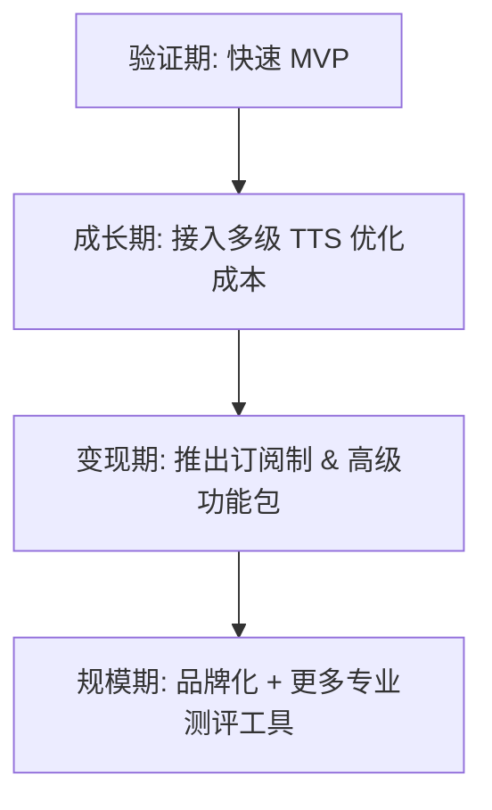

# AURA AI 心理咨询师商业化与成本优化方案

针对 ElevenLabs 成本高昂的问题以及 AURA (AI 心理咨询师) 的商业化落地，提出以下优化路径。

## 1. 成本优化策略 (针对 ElevenLabs 高额收费)

目前 ElevenLabs 属于顶尖级 TTS（语音合成），费用极高，不适合全量商业化推广。

### 方案 A：分级 TTS 服务架构 (推荐)
- **免费版/入门版**：使用更低成本的 TTS 服务。
    - **Apple/Android 原生 TTS**：完全免费，延迟最低。
    - **OpenAI TTS (tts-1)**：$15/1M 字符，比 ElevenLabs 低得多。
    - **Azure/Google Cloud TTS**：每月有大量免费额度，续费价格也更合理。
- **高级版 (VIP)**：仅在用户付费订阅后，解锁 **ElevenLabs (HD Voice)**。这样将大额成本转移到付费用户身上。

### 方案 B：自建/私有化部署 TTS
- **Coqui TTS / GPT-SoVITS**：在服务器部署开源模型。虽然需要 GPU 成本，但按量算下来比 ElevenLabs 规模化后便宜。
- **边缘侧 TTS**：利用手机本地的 AI 算力（如 OpenAI Whisper 运行在本地，TTS 运行在本地）。

---

## 2. AI 实时通信实现方案 (Real-time AI Interaction)

要实现像真人一样流畅的 AI 对话（低延迟、可打断、带情绪），需要解决传输层和编排层的问题。

### 2.1 协议选择
| 方案 | 优点 | 缺点 | 适用场景 |
|------|------|------|----------|
| **WebSocket** | 双向通信，支持流式 ASR/TTS | 需处理网络波动，Web 端开发成本中等 | 基础流式对话 |
| **WebRTC** | **超低延迟**，专为音视频设计 | 开发复杂度高，需 STUN/TURN 服务器 | **高拟人音频通话** |
| **SSE (Server-Sent Events)** | 简单，HTTP 兼容性好 | 仅支持单向流 (S->C) | 纯文字流式回复 |

### 2.2 推荐架构：混合流式管道
目前 AURA 采用的是 **ElevenLabs Agents SDK**，这是最快速的 WebRTC 链路方案。若未来需要自研以降低成本，推荐如下架构：

1.  **ASR (语音转文字)**：前端采集音频采样，通过 **WebSocket** 发送给后端/自研 ASR 节点（如 Whisper-Faster）。
2.  **LLM 编排 (逻辑中心)**：后端使用流式（Stream）接口请求模型（Claude/GPT），并在接收到前几个 Token 后立即开始请求 TTS。
3.  **TTS (文字转语音)**：使用 **流式合成**。一旦 LLM 吐出第一句话，立即喂给 TTS 引擎生成二进制音频流。
4.  **Audio Buffer (前端播放)**：前端维护一个音频播放队列，平滑处理网络阻塞带来的“顿挫感”。

### 2.3 关键技术点
- **VAD (静音检测)**：判断用户什么时候说完，自动触发 AI 回应。
- **Interruption (打断处理)**：当用户突然开口时，立即通过信号终止当前的 TTS 播放和 LLM 生成。
- **Turn-taking (轮替控制)**：确保对话节奏自然，避免 AI 和用户抢话。

---

## 3. 商业化付费模型 (Monetization Models)

基于心理咨询的特殊定位，建议采用 **"按时长订阅 + 增值包"** 模型。

### 2.1 基础订阅 (Membership)
- **月度会员 (¥29 - ¥49)**:
    * 解锁无限时长对话。
    * 情绪周报/月报。
    * 提供专业级的 TTS（如 Azure/Google 的高质音色）。
- **年度会员 (¥199 - ¥299)**:
    * 价格更低，提高用户长期粘性。

### 2.2 流量制/代币制 (Pay-as-you-go)
- 心理咨询通常是 **"按节"** 计算的。
- 推出 **"咨询点数"**：每 15 分钟消耗一点。
- 针对不想订阅的长尾用户。

### 2.3 深度增值服务 (Premium Add-ons)
- **声音克隆 (ElevenLabs 核心卖点)**：如果用户想让 AURA 声音像某个特定的人，这部分单独按量计费。
- **专业测评报告**：提供详尽的抑郁/焦虑量表深度分析 PDF。

---

## 3. 下一步行动 (Action Plan)

### 技术改造
1. **多 TTS 引擎接入**：在 `pro-go` 后端或 `voiceagent-rn` 前端实现引擎切换逻辑。
2. **流量监控**：统计每个用户的语音合成长度，以便精细化成本核算。

### 运营尝试
1. **灰度测试**：对部分用户测试 OpenAI TTS，观察留存率是否受音质影响显著。
2. **广告/权益分发**：观看激励视频获得 5 分钟 "高级音色" 体验。

---

## 4. 商业化路线图

